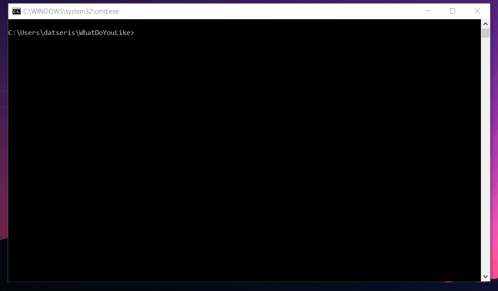

*the choices in the above example were made randomly*

1. [Description](#description)
1. [Installation](#installation)
1. [Usage](#usage)
1. [Customization](#customization)
1. [Acknowledgement](#acknowledgement)

# Description

This program plays a simple "game" with you to help you decide which "ideas" are the ones you like most, out of a pool of existing "ideas". When starting the application, you are required to choose 1 out of a choice of ideas (randomly selected from the pool). Your choice should be as spontaneous as possible; try to push yourself to choose within 5 seconds or less.

This choice process continues until you go through all ideas. Then a new "round" will begin, using the ideas chosen in the previous round. Rounds continue until you reach a lower limit of ideas (by default 3).

These "ideas" could be anything that is relevant for you right now. In the initial form of the game as it was introduced to me, the ideas were possible motivators and values (e.g. money, fame, independence, fun, meaning). This helped me decide what is important for me when choosing a career path. The default `ideas.txt` file has the original version of the game.

Besides playing the game with you the program also collects statistics for you in case you want to repeat the process in various stages in your life. Specifically the program saves:

* The total number of choices that you have made (accumulating each time you run it)
* A list of the final choices you have made and a list of which dates you made these choices at.

To use those you need to know Julia, see `main.jl` :)

# Installation
To run the "program" you need the Julia programming language. Install it from here: https://julialang.org/downloads/ .

You do not need to know how to use Julia to run the program! Only to install it!

To install the program first download this repository. Let's say you have downloaded the program in a folder called `game`. Then, open up the Julia REPL (on Linux type `julia` in your terminal) and go to the directory of the installation by doing:
```
julia> cd("path/to/game")
```
After that press `]` to access the package manager and do:
```
julia> ] # access package manager
pkg> instantiate .
```
This will install all dependencies for the program (very lightweight, don't worry).

# Usage

To run the program you can do one of two things:

1. Open a command line at the folder `game` and type `julia main.jl`.
2. Start the Julia REPL, change directory to the `game` folder (using the Julia function `cd`) and then type `include("main.jl")`.

The first time you will run the program it pre-compile the code, don't worry about this.

# Customization

You can customize the game. I used this game to help me understand what I really like about doing a PhD in physics. To do that change the file `ideas.txt` to include the ideas you want to choose from. Each line contains one idea. (The program works best for 24 ideas but any number works).

In addition you can change how many ideas to choose from or how many ideas to end up with, see the first three lines of the file `main.jl`.

# Acknowledgement
This program is MIT licensed, you can use it for free in any way you like as long as you attribute the original creator (George Datseris).

The game was introduced to me by Dr. Neela Enke: www.scienza-berlin.de.
